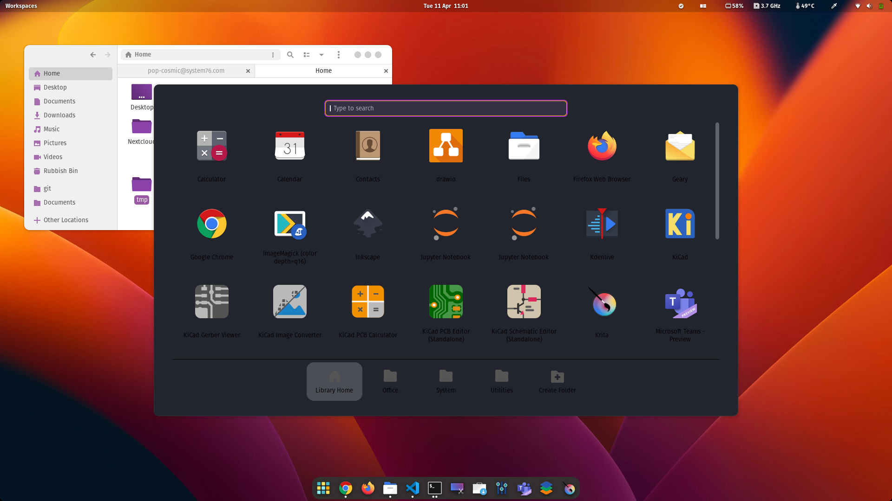
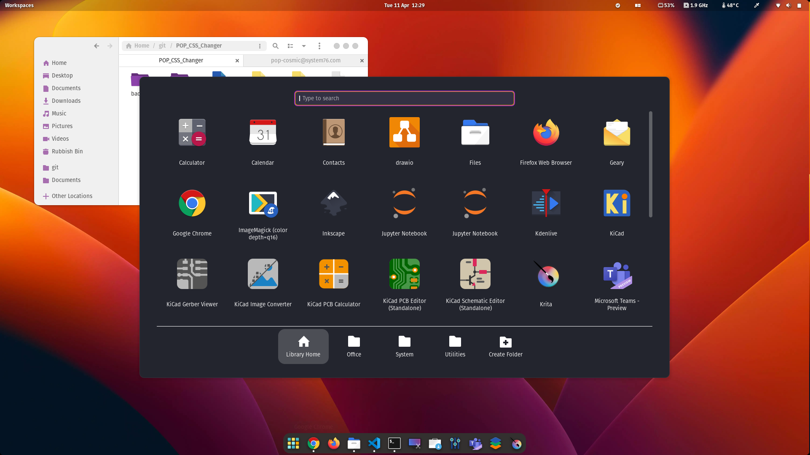

# Pop CSS Changer

While I love the usability of [Pop!_OS by System76](https://pop.system76.com/), I usually run my installs with custom Themes, since I want the shell to be in dark mode and gtk applications in light mode (for better readability over screenshare and in bright environments).

Unfortunately, the mixture of light and dark themes results in a non-ideal colour scheme for the "Show Applications" menu.

<center></center>

Inspired by [this repo](https://github.com/Itz-Abhishek-Tiwari/pop-os-dock-application-color-changer), I decided to create a more customisable 

# Installation

The application is based on Python and uses regular expressions and other built-in file manipulaiton methods. Python3 comes preinstalled with Pop!_OS, therefore we do not need to install anything.

# Usage

Clone this repository (`git clone ...`) to get started.

You can specify which colours should be changed in the [colours.json](./colours.json) file. The following fields are available:

- **filepath:**
    Path to the file in which you want to change properties

- **prop:**
    CSS property you want to apply changes to. see below for a list of properties I change on my install.

- **prevVal:**
    Previous value within the property that you want changed. "\\w*" matches any value (in this case the default value for colours).

- **newVal:**
    The updated value you want to assign to *prevVal*.

You can add as many entries to the list in the json file (see [here](https://developer.mozilla.org/en-US/docs/Learn/JavaScript/Objects/JSON) for info on how to format json files). If any of the four required fields is omitted, the previous value will be reused. This removes redundant filepath fields when changing multiple properties in a single file.

Once the colours are set, the script can be run using this command (superuser privilege is required since we are changing files outside the user's home directory):

```
sudo python3 applyColourChanges.py
```

Upon running the script for the first time, a backup folder will be created that stores the original version of each changed file.

# Default Changed Properties

The default configuration changes properties in the `/usr/share/gnome-shell/extensions/pop-cosmic@system76.com/light.css` file to make text in the application menu readable. These properties are set:

- **.cosmic-applications-dialog .overview-icon**
    Application names

- **.cosmic-applications-available**
    "Applications Available" text when searching Pop!_Shop apps from the application menu

- **.cosmic-applications-icon**
    App menu folder icon colour

- **.app-well-app:hover .overview-icon, .app-well-app:selected .overview-icon**
    Hover colour (white app names would barely be readable without this change)

- **.cosmic-applications-separator**
    Colour of horizontal line in app menu

After applying the change, press *Alt* + *F2*, enter *r* and press enter to restart the gnome session and see your changes in effect.

My configuration looks like this:

<center></center>


